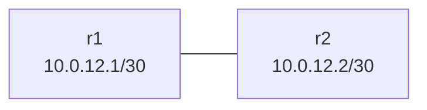

# frr-2router-basic Learning Guide

## What this lab is

This custom lab has two FRR routers connected by a single point-to-point link. It is the simplest place to practice interface IP setup and static routes.



## Concepts in plain English

- Static routes are manually configured paths.
- They are simple and predictable, but do not automatically adapt like OSPF/BGP.

## Deploy

```bash
sudo containerlab deploy -t labs/custom/frr-2router-basic/frr-2router-basic.clab.yml
```

## Commands to run

On r1:

```bash
docker exec -it clab-frr-2router-basic-r1 vtysh -c "show ip route"
```

On r2:

```bash
docker exec -it clab-frr-2router-basic-r2 vtysh -c "show ip route"
```

## What you just learned

- How to verify connected and static routes.
- How a minimal FRR topology is structured.
- Why static routing is useful for tiny labs and bootstrap scenarios.

## Cleanup

```bash
sudo containerlab destroy -t labs/custom/frr-2router-basic/frr-2router-basic.clab.yml --cleanup
```
