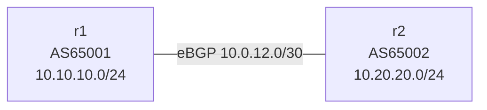

# frr-bgp-peering Learning Guide

## What this lab is

This custom lab creates an eBGP session between two FRR routers in different autonomous systems (AS65001 and AS65002).



## Concepts in plain English

- BGP is the routing protocol used between different networks (autonomous systems).
- Neighbors exchange route advertisements when the peering session is established.

## Deploy

```bash
sudo containerlab deploy -t labs/custom/frr-bgp-peering/frr-bgp-peering.clab.yml
```

## Commands to run

```bash
docker exec -it clab-frr-bgp-peering-r1 vtysh -c "show ip bgp summary"
docker exec -it clab-frr-bgp-peering-r1 vtysh -c "show ip bgp"
docker exec -it clab-frr-bgp-peering-r2 vtysh -c "show ip bgp"
```

## What you just learned

- How to establish a minimal eBGP peering.
- How each side advertises a local network.
- How to read BGP state and learned prefixes.

## Cleanup

```bash
sudo containerlab destroy -t labs/custom/frr-bgp-peering/frr-bgp-peering.clab.yml --cleanup
```
