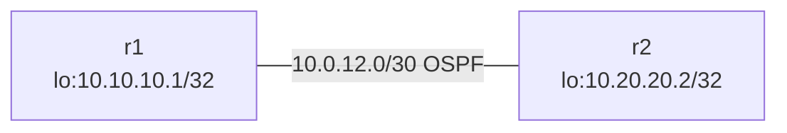

# frr-ospf-point2point Learning Guide

## What this lab is

This custom lab uses two FRR routers over one link, with OSPF enabled on the link and loopbacks.



## Concepts in plain English

- OSPF neighbors form when two routers share a link and area.
- Loopback addresses are often used as stable router identities.

## Deploy

```bash
sudo containerlab deploy -t labs/custom/frr-ospf-point2point/frr-ospf-point2point.clab.yml
```

## Commands to run

```bash
docker exec -it clab-frr-ospf-point2point-r1 vtysh -c "show ip ospf neighbor"
docker exec -it clab-frr-ospf-point2point-r1 vtysh -c "show ip route ospf"
docker exec -it clab-frr-ospf-point2point-r2 vtysh -c "show ip route ospf"
```

## What you just learned

- How to bring up a basic OSPF adjacency.
- How loopback routes are exchanged with OSPF.
- How to verify OSPF-learned routes from CLI.

## Cleanup

```bash
sudo containerlab destroy -t labs/custom/frr-ospf-point2point/frr-ospf-point2point.clab.yml --cleanup
```
