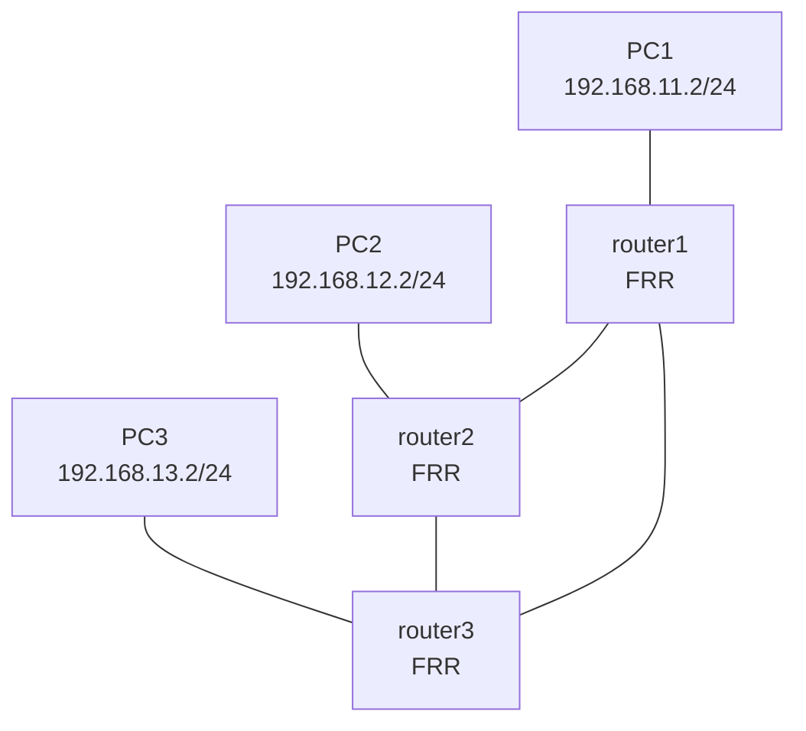

# frr01 Learning Guide

## What this lab is

This official lab builds a 3-router FRR ring with 3 attached Linux hosts. It is a great first OSPF lab because you can see dynamic routing and end-to-end reachability.



## Concepts in plain English

- OSPF lets routers automatically discover and advertise networks.
- A ring topology still converges if one link fails (after reconvergence).

## Deploy

```bash
sudo containerlab deploy -t labs/official/frr01/frr01.clab.yml
```

## Commands to run

Open router consoles and run:

```bash
vtysh -c "show ip ospf neighbor"
vtysh -c "show ip route ospf"
vtysh -c "show ip route"
```

From host containers:

```bash
docker exec -it clab-frr01-PC1 ping -c 3 192.168.13.2
```

## What you just learned

- How to deploy an official FRR lab.
- How to verify OSPF adjacencies and learned routes.
- How host-to-host traffic uses dynamic routing paths.

## Cleanup

```bash
sudo containerlab destroy -t labs/official/frr01/frr01.clab.yml --cleanup
```
