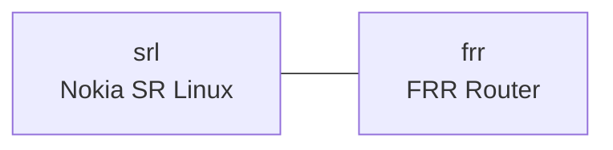

# srlfrr01 Learning Guide

## What this lab is

This official interop lab connects one Nokia SR Linux node to one FRR router. It is useful for understanding multi-vendor control-plane basics.



## Concepts in plain English

- Interoperability means different network operating systems can exchange routes and forward traffic together.
- You can test standards-based behavior without needing physical hardware.

## Deploy

```bash
sudo containerlab deploy -t labs/official/srlfrr01/srlfrr01.clab.yml
```

## Commands to run

On the FRR node:

```bash
docker exec -it clab-srlfrr01-frr vtysh -c "show running-config"
```

On the SR Linux node:

```bash
docker exec -it clab-srlfrr01-srl sr_cli -d -c "show network-instance default"
```

## What you just learned

- How to launch a cross-vendor topology.
- Where to inspect baseline control-plane configuration on both platforms.
- How to build confidence for interop labs before adding protocols.

## Cleanup

```bash
sudo containerlab destroy -t labs/official/srlfrr01/srlfrr01.clab.yml --cleanup
```
